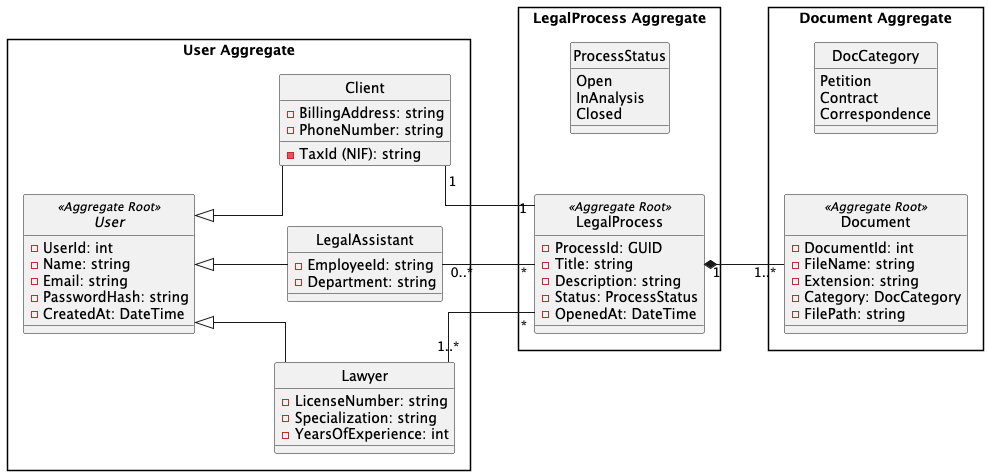

# Analysis

## Overview do sistema

O projeto *Lawyer App* consiste no desenvolvimento de um sistema back-end para uma 
empresa de consultoria jurídica, concebido de raiz seguindo as práticas do Ciclo 
de Vida de Desenvolvimento de Software Seguro (SSDLC). O sistema visa digitalizar 
e proteger a gestão de clientes, a instrução de processos jurídicos e o arquivo de documentação sensível.

## Modelo de domínio

Alinhado com os conceitos de Domain-Driven Design (DDD), a lógica de negócio do sistema está ancorada em pelo menos três agregados principais:

- Utilizadores: Gestão de identidades e perfis de acesso.

- Processos Jurídicos: Agregado central que mapeia os casos e faz a ponte entre clientes e advogados.

- Documentos: Gestão do ciclo de vida dos ficheiros e respetivos metadados.

## Arquitetura do sistema

A aplicação é materializada através de uma Web API (REST) com HTTPS. 
O BackEnd vai ser desenvolvido em .NET, enquanto a persistência de dados será garantida por uma base de dados relacional (garantindo que não 
são utilizadas bases de dados em memória) PostgreSQL.
Relativamente ao KeyVault, vamos utilizar o HashiCorp Vault para a persistência de secrets.
Um dos componentes críticos da arquitetura é a 
interação direta do servidor com o sistema operativo, sendo responsável pela execução de 
funcionalidades como a criação autónoma de estruturas de diretórios para cada novo processo 
e a gestão de leitura/escrita de ficheiros físicos (PDF e DOCX).

