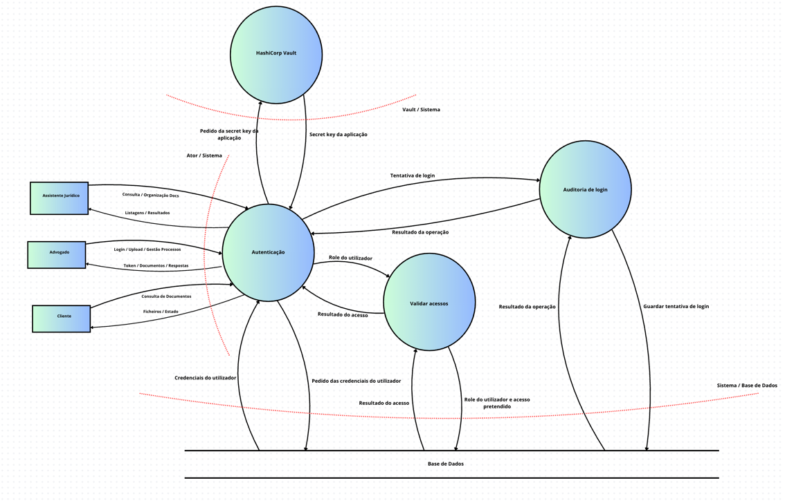
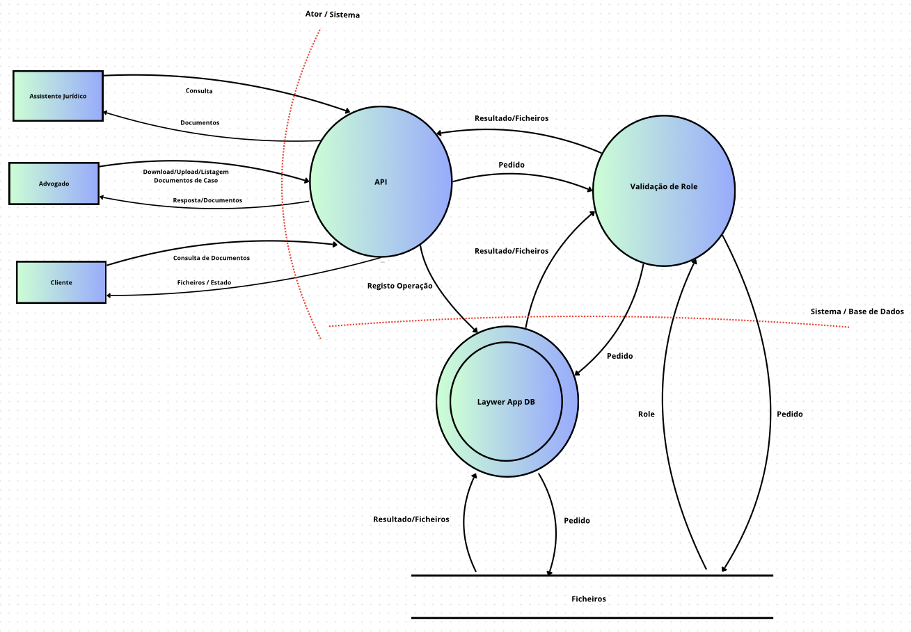

# Level 0 Dataflow

# Level 1 DataFlows

## RF01 Gestão de Perfis de Utilizador (RBAC)

## RF02 Gestão Documental

## RF03 Organização de Sistema de Ficheiros

## RF04 Auditoria de Acessos e Logging

