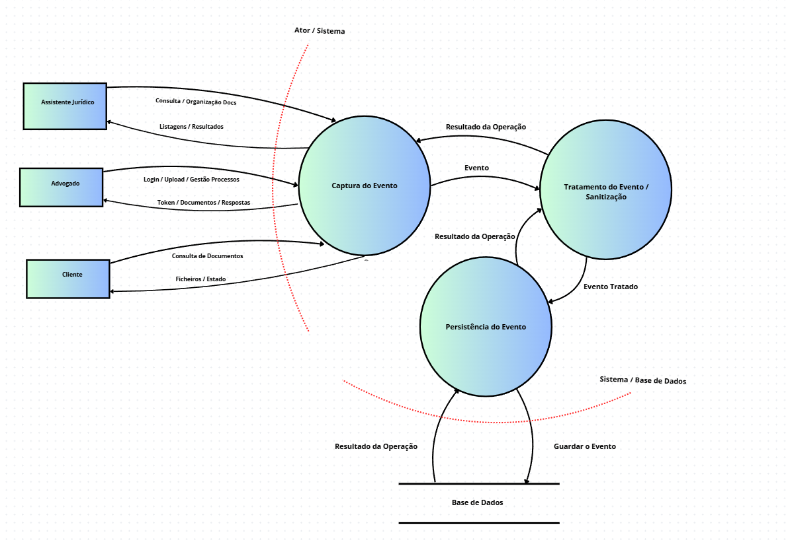

# Threat ID

- STRIDE-per-element analysis
- Detailed attack vectors
- Abuse cases for threat agents

O que é o Stride?

STRIDE é um modelo usado em cibersegurança para identificar e classificar ameaças num sistema durante a fase de análise (threat modeling).

Cada letra representa um tipo de ameaça:

S — Spoofing (Falsificação de identidade):
- Um atacante finge ser outro utilizador (ex: roubo de credenciais, login falso).

T — Tampering (Manipulação):
- Alteração não autorizada de dados ou sistemas (ex: modificar logs ou pedidos).

R — Repudiation (Repúdio):
- Um utilizador nega ter realizado uma ação, sem prova de registo.

I — Information Disclosure (Divulgação de informação):
- Exposição de dados confidenciais a pessoas não autorizadas.

D — Denial of Service (Negação de serviço):
- Ataques que tornam o sistema indisponível ou lento.

E — Elevation of Privilege (Escalada de privilégios):
- Um utilizador obtém permissões superiores às que deveria ter.

## 4 Análise STRIDE - RF04 (Auditoria e Logging)

Esta análise foca-se nos processos internos do sistema de auditoria da Lawyer App.  
Aplica-se o modelo STRIDE a cada elemento do DFD para identificar vetores de ataque e agentes de ameaça específicos.

---

### 4.1 Mapeamento STRIDE por Elemento

| ID | Elemento | Elemento DFD | STRIDE | Ameaça Identificada |
|----|----------|--------------|--------|---------------------|
| P4.1 | Captura de Evento | Processo | S / T / R | Interceção ou forja de eventos antes do registo |
| P4.2 | Tratamento do Evento | Processo | T / R / I | Injeção de caracteres maliciosos ou fuga de dados sensíveis |
| DS4.1 | Persistência (PostgreSQL) | Data Store | T / R / I | Modificação ou eliminação de registos de auditoria |
| DS4.2 | Atores do Sistema | Entidade Externa | S / D / T | Falsificação de Identidade e sobrecarga do Sistema |
---

### 4.2 Detalhe das Ameaças e Vetores de Ataque

### A. Processo: Tratamento do Evento (P4.2)

**Ameaça (Tampering / Repudiation):** Log Injection  

**Agente de Ameaça:**  
Utilizador interno (ex: Assistente Jurídico malicioso)

**Vetor de Ataque:**  
Inserção de caracteres especiais ou sequências de escape em inputs da API, como:
- `\n`
- `\r`
- payloads maliciosos

**Impacto:**  
- Corrupção da integridade dos logs  
- Dificuldade ou impossibilidade de análise forense  
- Possível ocultação de ações maliciosas  

---

### B. Data Store: Persistência do Evento (DS4.1)

**Ameaça (Information Disclosure / Tampering):** Acesso indevido à base de dados de logs  

**Agente de Ameaça:**  
- Atacante externo  
- Utilizador com permissões de Cliente mal configuradas  

**Vetor de Ataque:**  
- SQL Injection no backend  
- Falhas de RBAC (controlo de acessos incorreto)  

**Impacto:**  
- Exposição de metadados sensíveis  
- Comprometimento de processos jurídicos  
- Violação de confidencialidade  

---

### C. Processo: Captura de Evento (P4.1)

**Ameaça (Spoofing):** Forja de eventos de sistema  

**Agente de Ameaça:**  
Atacante que comprometeu sessão ou token de autenticação  

**Vetor de Ataque:**  
- Envio direto de requests falsificados para o serviço de logging  
- Simulação de ações realizadas por outros utilizadores  

**Impacto:**  
- Quebra de não-repúdio  
- Atribuição incorreta de ações  
- Perda de confiança nos logs  

---

### D. Entidade Externa: Atores do Sistema (RF01)

**Ameaça (Spoofing / Denial of Service / Tampering):**  
Falsificação de identidade e abuso de funcionalidades legítimas do sistema

**Agente de Ameaça:**  
- Utilizador externo malicioso  
- Cliente com credenciais comprometidas  
- Utilizador autenticado (Advogado ou Assistente Jurídico malicioso)  
- Bot automatizado  

**Vetor de Ataque:**  
- Uso de credenciais roubadas para simular ações legítimas (login, acesso a processos ou documentos)  
- Execução massiva de operações válidas (upload/download/logging flood)  
- Exploração de permissões legítimas para gerar carga excessiva no sistema  
- Tentativas de acesso repetido a endpoints protegidos (brute force / automation)  

**Impacto:**  
- Quebra de autenticidade dos utilizadores (Spoofing)  
- Sobrecarga da API e do sistema de auditoria (Denial of Service)  
- Geração excessiva de logs, afetando performance da base de dados  
- Possível escalada de ataques internos via utilizadores válidos comprometidos  

**Mitigações sugeridas:**  
- Autenticação forte com JWT + expiração curta  
- Rate limiting por utilizador e por IP  
- Deteção de comportamento anómalo (anomaly detection)  
- Bloqueio automático após tentativas suspeitas  
- Separação de privilégios entre roles (RF01 RBAC)  

### 4.3 Avaliação de Risco (Risk Assessment)

| Ameaça | Probabilidade | Impacto | Risco | Justificação |
|--------|--------------|----------|-------|--------------|
| Log Injection | Média | Alto | Alto | Afeta integridade da auditoria e análise forense |
| Manipulação da DB de Logs | Baixa | Crítico | Muito Alto | Pode eliminar rastros de ataques persistentes |
| Interceção de Fluxo | Média | Médio | Médio | Mitigado por TLS, mas crítico em ambientes internos |
| Falsificação de Identidade (Spoofing) | Média | Alto | Alto | Uso de credenciais roubadas para assumir identidade de outro utilizador |
| Abuso de Funcionalidades (Application Abuse) | Alta | Alto | Alto | Utilizadores autenticados exploram permissões legítimas para ações maliciosas |
| Denial of Service (DoS / Flood de Requisições) | Média | Crítico | Muito Alto | Sobrecarga da API e do sistema de logging através de pedidos massivos |
| Brute Force / Automation Attack | Média | Médio | Alto | Tentativas repetidas de autenticação para acesso não autorizado |
| Escalada de Ataques via Conta Comprometida | Baixa | Crítico | Muito Alto | Contas válidas são usadas como ponto de entrada para ataques internos |
---